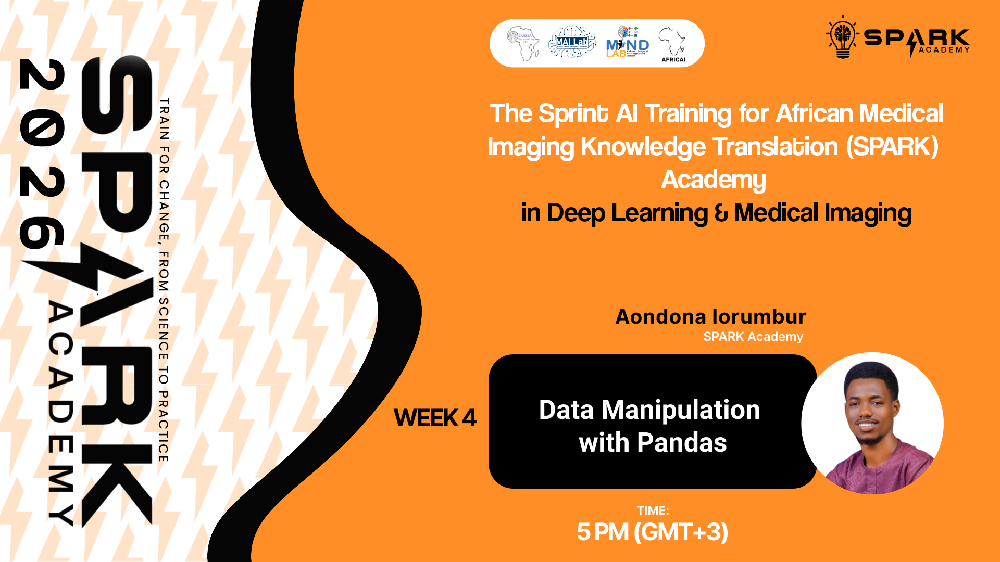

<p align="center">
  
  
  
</p>

<h1 align="center">SPARK 2026 | Foundation Week 4</h1>
<h3 align="center">Medical Imaging IV, Data Manipulation with Pandas, and Mini-Capstone Project</h3>

<p align="center">
  <em>Building AI capacity for medical imaging across Africa</em>
</p>

---

## Overview

Welcome to Week 4 of SPARK Academy 2026! This week covers advanced medical imaging, data manipulation with Pandas, an introduction to data visualization, and an overview of machine learning in healthcare — culminating in the Mini-Capstone Project, where you'll apply your skills to a real-world medical imaging challenge.

**This week covers five sessions:**

| # | Session | Facilitator | Format |
|---|---------|-------------|--------|
| 1 | Data Manipulation with Pandas | | Pre-recorded |
| 2 | Mini-Capstone Project Overview | | Live |
| 3 | Introduction to Data Visualization | | Live |
| 4 | Overview of Machine Learning: Types and Applications in Healthcare | | Pre-recorded |

---

## Session 1: Data Manipulation with Pandas

*(Pre-recorded)* Hands-on introduction to Pandas — the essential Python library for loading, cleaning, and manipulating tabular data, a foundational skill for any medical AI pipeline.

**Topics Covered:**
- Introduction to DataFrames and Series
- Loading and exploring datasets
- Data cleaning and preprocessing
- Filtering, grouping, and aggregating data
- Practical examples with medical datasets

> 📂 **Slides:** [`SPARK2026_FDN_W04_Data_Manipulation_Pandas.pptx`](slides/SPARK2026_FDN_W04_Data_Manipulation_Pandas.pptx)

**Click the image below to watch the recorded session:**

[](https://youtu.be/uZQZ4w1y_PM)

### Training Notebooks

| Google Colab | Kaggle |
|:---:|:---:|
| [](https://colab.research.google.com/) | [](https://www.kaggle.com/) |

---

## Session 2: Mini-Capstone Project Overview

A live session introducing the Week 4 Mini-Capstone Project — outlining the problem statement, deliverables, evaluation criteria, and submission process.

**Click the image below to watch the recorded session:**

[](https://youtu.be/WfsTr2072OE)

### Training Notebooks

| Google Colab | Kaggle |
|:---:|:---:|
| [](https://colab.research.google.com/drive/15rdV5iMMTRHhvgdr_dtvfZg6hIO2xWO3?usp=sharing) | [](https://www.kaggle.com/code/spark2025/spark-2026-mini-capstone-project-overview) |


---

## Session 3: Introduction to Data Visualization

A live session covering the principles and tools for visualizing medical and tabular data — an essential skill for communicating findings and understanding model behaviour.

**Topics Covered:**
- Principles of effective data visualization
- Plotting with Matplotlib and Seaborn
- Visualizing medical imaging data and statistics
- Interpreting and presenting results

> 📂 **Slides:** [`SPARK2026_FDN_W04_Data_Visualization.pptx`](slides/SPARK2026_FDN_W04_Data_Visualization.pptx)

**Click the image below to watch the recorded session:**

[](https://youtu.be/f3minGQqSOw)

### Training Notebooks

| Google Colab | Kaggle |
|:---:|:---:|
| [](https://colab.research.google.com/drive/1DNXFR9c8H1aeJ-tpK10RGPvmBgdcNhJ_?usp=sharing) | [](https://www.kaggle.com/code/spark2025/spark-2026-introduction-to-data-visualization) |

---

## Session 4: Overview of Machine Learning: Types and Applications in Healthcare

A live session introducing the landscape of machine learning — supervised, unsupervised, and reinforcement learning — with a focus on real-world applications in healthcare and medical imaging.

**Topics Covered:**
- Types of machine learning (supervised, unsupervised, reinforcement)
- Key algorithms and their use cases
- Applications of ML in healthcare and medical imaging
- Challenges and opportunities in clinical AI

> 📂 **Slides:** [`SPARK2026_FDN_W04_Overview_Machine_Learning.pptx`](slides/SPARK2026_FDN_W04_Overview_Machine_Learning.pptx)

**Click the image below to watch the recorded session:**

[](https://youtu.be/2Q8bETSDFpw)

---

## Assignment

> **Week 4 Assignment: Mini-Capstone Project**
>
> Apply everything you've learned so far! Complete the Mini-Capstone Project by working through the provided problem, demonstrating your skills in data manipulation, visualization, and medical imaging analysis.
>
> | | |
> |---|---|
> | **Platform** | GitHub Classroom |
> | **Deadline** | Friday 20th March 2026 · 11:59 PM (GMT+1) |
> | **Submission** | Push your completed work to the GitHub Classroom repository |
>
> [](https://classroom.github.com/a/dNK7xGxu)
>
> **Before you start:**
> 1. Create a free GitHub account for your team at [github.com](https://github.com/signup) if you don't already have one
> 2. Accept the assignment(Mini Capstone) using your team GitHub account.

---

## Folder Structure

```
SPARK 2026 | Foundation Week 4 - Medical Imaging IV, Data Manipulation with Pandas, and Mini-Capstone Project/
├── README.md
├── slides/
│   ├── SPARK2026_FDN_W04_Intro_Medical_Imaging_IV.pptx
│   ├── SPARK2026_FDN_W04_Data_Manipulation_Pandas.pptx
│   └── SPARK2026_FDN_W04_Overview_Machine_Learning.pptx
├── thumbnails/
│   ├── medical.png
│   ├── pandas.png
│   ├── capstone.png
│   ├── visualization.png
│   └── ml.png
├── notebooks/
│   ├── SPARK2026_FDN_W04_Data_Manipulation_Pandas.ipynb
│   └── SPARK2026_FDN_W04_Data_Visualization.ipynb
```

---

## Additional Resources

**Pandas:**
- [Pandas Official Documentation](https://pandas.pydata.org/docs/)
- [Pandas Getting Started](https://pandas.pydata.org/docs/getting_started/index.html)
- [W3Schools Pandas Tutorial](https://www.w3schools.com/python/pandas/)

**Data Visualization:**
- [Matplotlib Documentation](https://matplotlib.org/stable/contents.html)
- [Seaborn Documentation](https://seaborn.pydata.org/)
- [Python Graph Gallery](https://www.python-graph-gallery.com/)

**Machine Learning:**
- [Scikit-learn Documentation](https://scikit-learn.org/stable/)
- [Google Machine Learning Crash Course](https://developers.google.com/machine-learning/crash-course)
- [Towards Data Science - ML in Healthcare](https://towardsdatascience.com/machine-learning-in-healthcare)

**Medical Imaging:**
- [Radiopaedia - Medical Imaging](https://radiopaedia.org/)
- [Questions and Answers in MRI](https://mriquestions.com/index.html)

---

<p align="center">
  <strong>SPARK Academy 2026</strong><br/>
  <em>Empowering the next generation of AI researchers in medical imaging across Africa</em>
</p>

<p align="center">
  <a href="https://github.com/SPARK-Academy-2025/SPARK-2026">GitHub</a> ·
  <a href="https://www.cameramriafrica.org/contact">Contact</a> ·
  <a href="https://www.cameramriafrica.org/spark">Website</a>
</p>